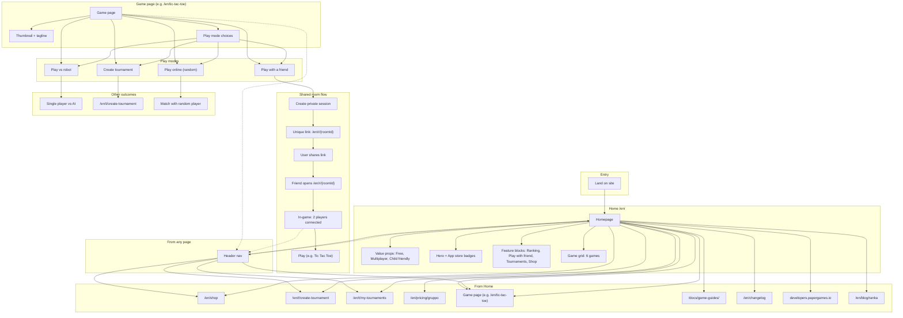

# Papergames.io UX flow diagram

Reference: [papergames.io](https://papergames.io/en/). Diagram covers homepage, game page, and shared room flow.

## Mermaid flowchart

## Simplified user paths

| Path | Steps |
|------|--------|
| **Home to game** | Home -> click game card -> Game page |
| **Play with friend** | Game page -> "Play with a friend" -> get /en/r/{id} -> share link -> friend opens -> both in game |
| **Play vs robot** | Game page -> "Play vs robot" -> single-player game |
| **Tournament** | Game page or Home -> "Create tournament" -> /en/t/create-tournament |
| **Random opponent** | Game page -> "Play online" -> matchmaking -> game |
| **Direct room link** | User receives /en/r/{roomId} -> opens URL -> joins existing session (wait or play) |

## URL structure (observed)

- **Home**: `/en/`
- **Game pages**: `/en/{game-slug}` (e.g. `tic-tac-toe`, `battleship`, `connect4`, `gomoku`, `chess`, `checkers`)
- **Shared room**: `/en/r/{roomId}` (e.g. `Zpdu9dX6A`, `T-BYp7tpLV`) — play-with-a-friend session
- **Tournaments**: `/en/t/create-tournament`, `/en/t/my-tournaments`
- **Other**: `/en/shop`, `/en/pricing/gruppo`, `/docs/game-guides/`, `/en/changelog`, `/en/blog/ranka`

## Takeaways for Ursa Minor

- Clear funnel: Home -> Game -> Play mode -> Room or match.
- Shared link (/r/) is the core “play with a friend” mechanic; one link, no signup required (guest play).
- Same header from home, game page, and in-room keeps navigation consistent.
- Game page is the decision point: four play modes with distinct outcomes (friend, robot, tournament, random).
